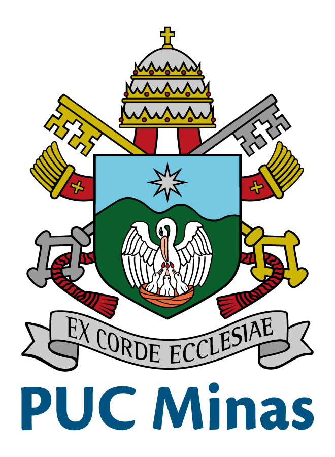

###

<h1>

    +Meu+nome+é+Lucas+Spiazzi;>+Sou+Engenheiro+de+Software;>+Aqui+está+um+pouco+sobre+mim;>+Obrigado+pela+visita!!" />

</h1>

<h2>
  
Um pouco da minha história ✨ :

</h2>

  

    
  

  

    

      Desde pequeno, meu interesse por tecnologia surgiu junto com os vídeo-games. Sempre fui curioso, explorando configurações, aprendendo a mexer em sistemas e resolvendo problemas por conta própria. Gostava de descobrir como as coisas funcionavam, desvendando mistérios e buscando soluções, acho que essa foi a base pra tudo, além de me tornar bem aculturado.
    

  

  

    

      Durante o ensino médio, tive a chance de fazer um curso técnico em informática no Senac, em Contagem/MG. Lá, mergulhei em temas como hardware, software, sistemas operacionais, redes, design, desenvolvimento e programação. Essa experiência foi decisiva: ao participar de projetos e escrever minhas primeiras linhas de código, percebi que era exatamente isso que eu queria seguir. A certeza de estar no caminho certo ficou clara desde então.
    

  

  

    
  

  

    
  

  

    

      Aos 19 anos, decidi iniciar minha graduação. Após muita pesquisa, percebi que Engenharia de Software era o curso que mais combinava com meus interesses: análise, planejamento, modelagem e desenvolvimento de projetos de software. Escolhi a PUC Minas para dar esse passo importante, e sigo em formação, aprendendo e evoluindo a cada semestre, tentando viver um pouco também. Tem sido uma jornada maravilhosa e cheia de novas visões, oportunidades e parcerias.
    

  

###

<h2>
  
Já passou pelas minhas mãos 💻 :

</h2>

###

###

<h2>

Minhas estatística 📈 :

</h2>

###

  
  

###

<h3>

  

    
Me da um follow 🥺 :

    

      
      
      
      
    

  

</h3>
