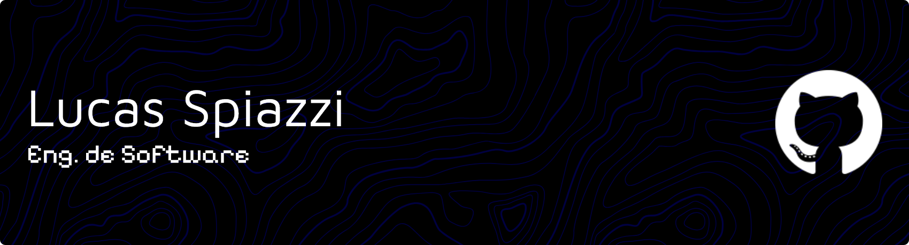

  

### 

---

<h2 align="center">
Um pouco da minha história ✨
</h2>

_Desde pequeno, meu interesse por tecnologia surgiu junto com os **vídeo-games**. Sempre fui curioso, explorando configurações, aprendendo a mexer em sistemas e resolvendo problemas por conta própria. Gostava de descobrir como as coisas funcionavam, desvendando mistérios e buscando soluções. Acho que essa foi a base para tudo, além de me tornar bem aculturado._

_Durante o ensino médio, tive a chance de fazer um curso **Técnico em Informática** no **Senac**, em Contagem/MG. Lá, mergulhei em temas como **hardware**, **software**, **sistemas operacionais**, **redes**, **design**, **desenvolvimento** e **programação**. Essa experiência foi decisiva: ao participar de projetos e escrever minhas primeiras linhas de código, percebi que era exatamente isso que eu queria seguir. A certeza de estar no caminho certo ficou clara desde então._

_Aos 19 anos, decidi iniciar minha graduação. Após muita pesquisa, percebi que **Engenharia de Software** era o curso que mais combinava com meus interesses: **análise**, **planejamento**, **modelagem** e **desenvolvimento de projetos de software**. Escolhi a **PUC Minas** para dar esse passo importante, e sigo em formação, aprendendo e evoluindo a cada semestre, tentando viver um pouco também. Tem sido uma jornada maravilhosa e cheia de novas visões, oportunidades e parcerias._

---

<h2 align="center">
Já passou pelas minhas mãos 💻
</h2>

  
  
  
  
  
  
  
  
  
  
  
  
  
  
  
  
  
  
  
  
  
  

---

<h2 align="center">
Minhas estatísticas 📈
</h2>

  
  

---

<h2 align="center">
Me dá um follow 🥺
</h2>

  
  
  
  

